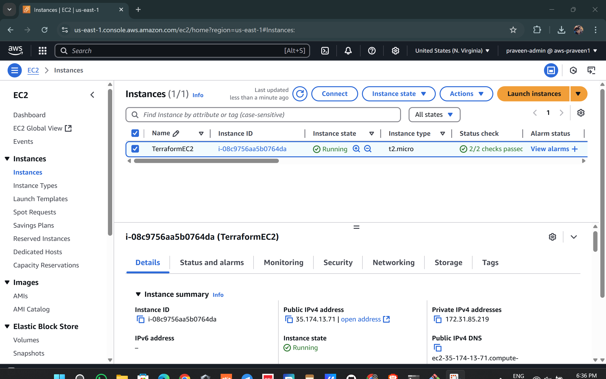
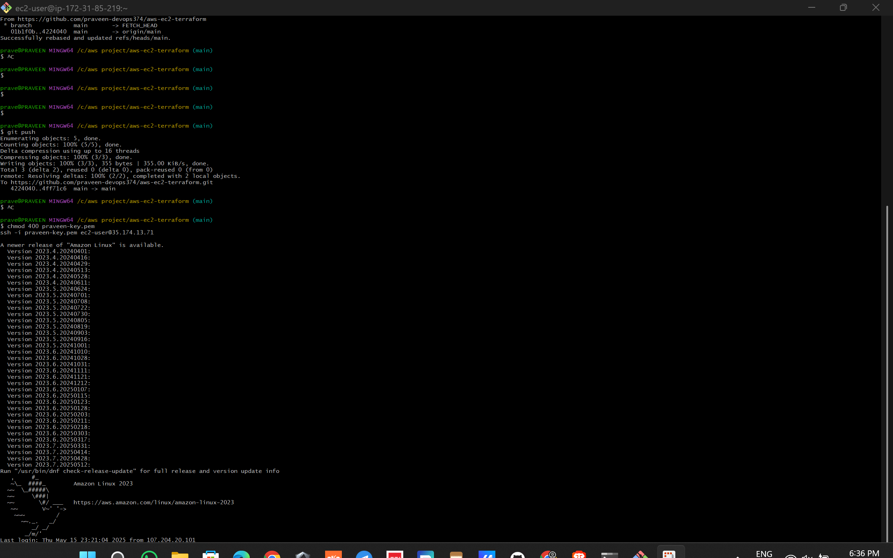
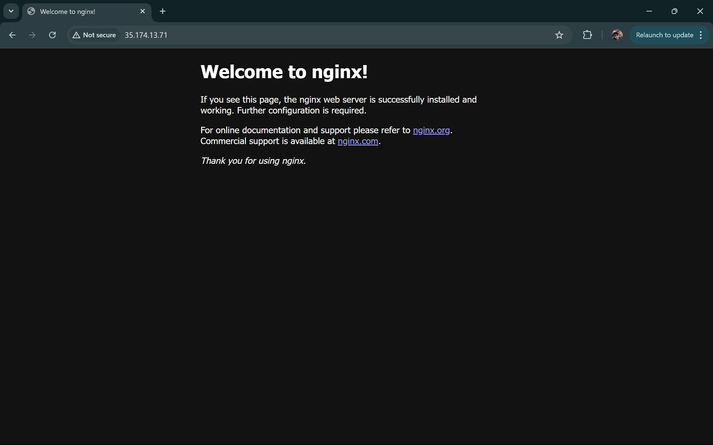
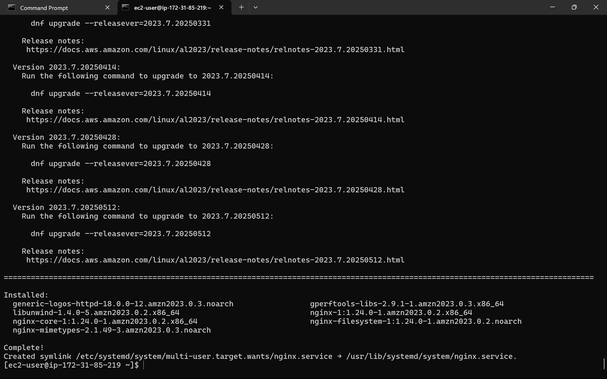

# Terraform EC2 Instance Setup

This project provisions an EC2 instance on AWS using Terraform. It demonstrates Infrastructure as Code (IaC) principles, automating cloud infrastructure provisioning in a repeatable and consistent way.

---

## 🚀 What This Project Does

- Creates a t2.micro EC2 instance in AWS (Free Tier eligible)
- Uses a key pair (`praveen-key.pem`) for secure SSH access
- Outputs instance ID and public IP after creation
- Keeps infrastructure modular using variables and outputs

---

## 🧰 Tools Used

- Terraform
- AWS EC2
- Git & GitHub
- Git Bash (for SSH and Git operations)

---

## ⚙️ Configuration Details

- **Region:** us-east-1 (N. Virginia)
- **AMI ID:** `ami-0c101f26f147fa7fd` (Amazon Linux 2 AMI)
- **Instance Type:** `t2.micro`
- **Key Pair Name:** `praveen-key` (generated from AWS Console)

---

## 📁 Project Files

| File         | Purpose                                 |
|--------------|------------------------------------------|
| `main.tf`    | Defines EC2 instance and provider config |
| `variables.tf` | Stores region, AMI ID, instance type, and key name |
| `outputs.tf` | Outputs instance ID and public IP        |
| `.gitignore` | Excludes `.pem`, `.tfstate`, and `.terraform/` directories from GitHub |

---

## 🛠️ How to Deploy

```bash
terraform init
terraform plan
terraform apply


## 📸 Screenshots

### ✅ Terraform Apply Output
Shows successful provisioning of EC2 with instance ID and public IP.


---

### ✅ AWS EC2 Console
Confirms the instance is up and running in AWS.



---

### ✅ SSH Access
Proves secure connection using `.pem` key.



### ✅ NGINX in Browser

These screenshots show the NGINX welcome page running on the EC2 instance.

#### 🌐 Screenshot 1: NGINX Server Window  


#### 🌐 Screenshot 2: NGINX Successful in Browser  


